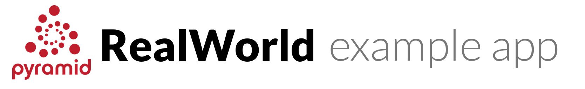

# 

  
  
  
  
  
  
  

> ### Pyramid codebase containing real world examples (CRUD, authentication, authorization, advanced patterns, and so on) that adhere to the [RealWorld](https://github.com/gothinkster/realworld) specification and API.

### Demos

> This is deployed on Heroku and is configured to automatically sleep after an hour of inactivity. If you get Application Error, refresh again in a minute or two.

- [Demo (app)](https://pyramid-realworld.herokuapp.com/)
- [Demo (api)](https://pyramid-realworld.herokuapp.com/api)

This codebase was created to demonstrate a fully fledged fullstack application built with **Pyramid** including CRUD operations, authentication, routing, pagination, and more.

We've gone to great lengths to adhere to the **Pyramid** community style guides and best practices. You are encouraged to [use it as a scaffold/template](https://github.com/teamniteo/pyramid-realworld-example-app/generate) for your next Pyramid project.

For more information on how this works with other frontends/backends, head over to the [RealWorld](https://github.com/gothinkster/realworld) repo.

# How it works

The application is built with Pyramid, using [pyramid_openapi3](https://github.com/pylons/pyramid_openapi3) for request/response validation and [pyramid_deferred_sqla](https://github.com/teamniteo/pyramid_deferred_sqla) for PostgreSQL integration. It is deployed to [Heroku](https://pyramid-realworld.herokuapp.com/api).

Pyramid serves one of the [RealWorld.io frontends](https://github.com/gothinkster/realworld#frontends) (Elm) on root, so it is easier to understand how things fit together. The frontend is interchangeable. You can use any
RealWorld.io frontend.

# Getting started

To set up your development environment, there are some dependencies you need to install on your system.
You can either install them manually, or use [Nix](https://nixos.org/nix) and [direnv](https://direnv.net/)
to install them automatically (except Docker which you need to install manually).

First ensure that you have [Docker](https://www.docker.com) installed on your system.
Then choose one option to install pre-requisites.

## Option 1: Install pre-requisites manually

- [python 3.9](https://www.python.org) (we recommend using [pyenv](https://github.com/pyenv/pyenv) for installing Python).
- [poetry](https://github.com/python-poetry/poetry)
- [node](https://nodejs.org) & [jq](https://github.com/stedolan/jq) (to run postman tests)

Activate the virtual environment, then continue to Install RealWorld Example App.

If you have any dependency related issue, check out `./shell.nix` for the specific version of dependencies.

## Option 2: Install pre-requisites using Nix

- Install the [Nix package manager](https://nixos.org/nix).
- Install and configure [Direnv](https://direnv.net)
- Run `direnv allow` in the project root.

## Install and Run RealWorld Example App

Docker should be running. Then you can run:

    $ cd ~/projects
    $ git clone https://github.com/teamniteo/pyramid-realworld-example-app.git
    $ cd pyramid-realworld-example-app
    $ make install
    $ make start-pgsql
    $ make devdb
    $ make run

Now point your browser to:
 * http://localhost:8080/ -> Conduit frontend app using the API
 * http://localhost:8080/api -> Swagger documentation for the API

To run unit tests, mypy typing checker and flake8 linter:

    $ make tests

To stop Docker and clean the container, you can run:

    $ make stop-pgsql
    $ make clean-pgsql
